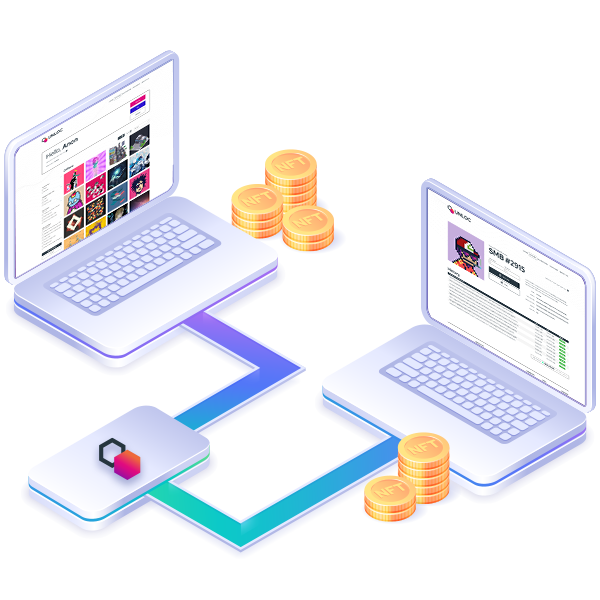
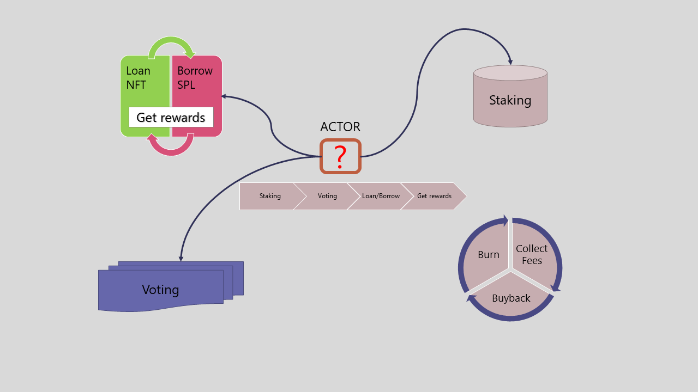
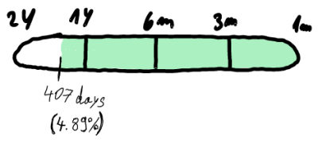
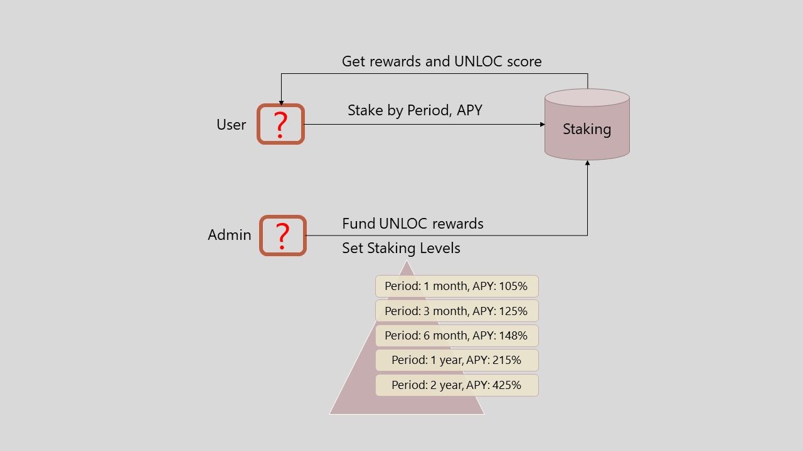
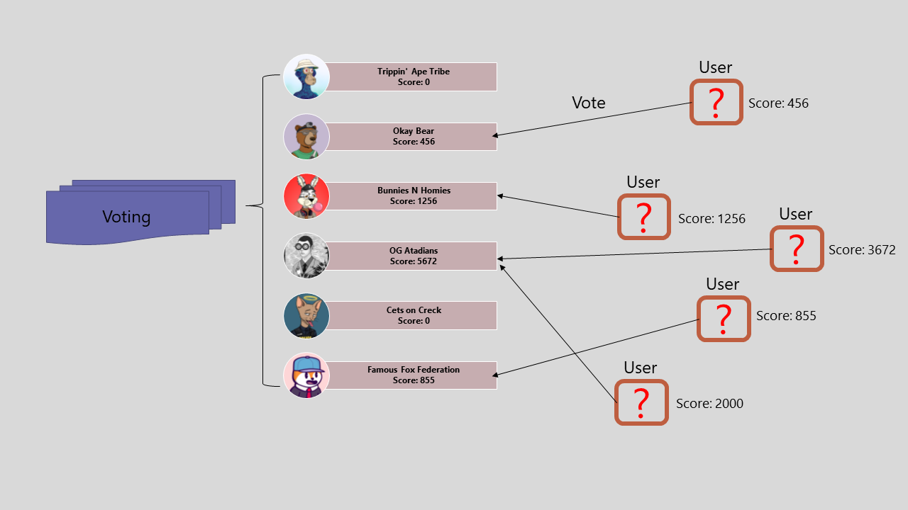
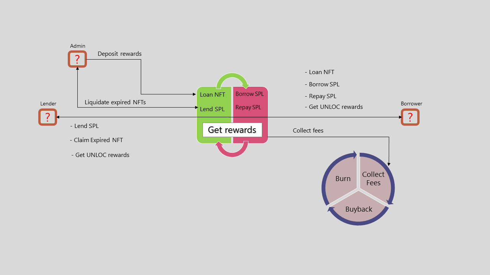
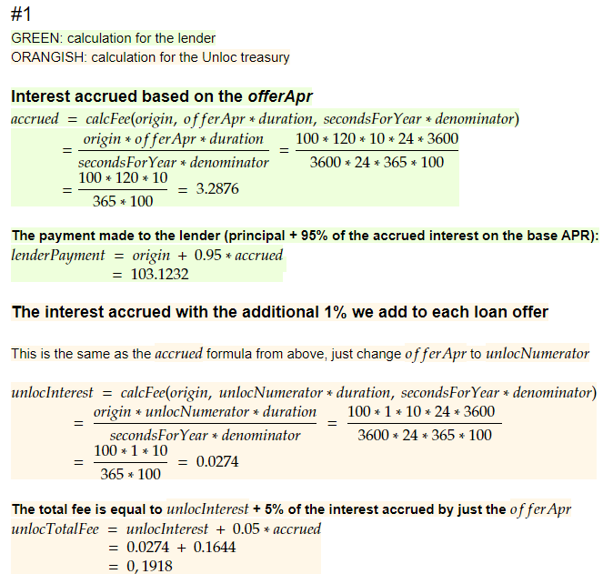
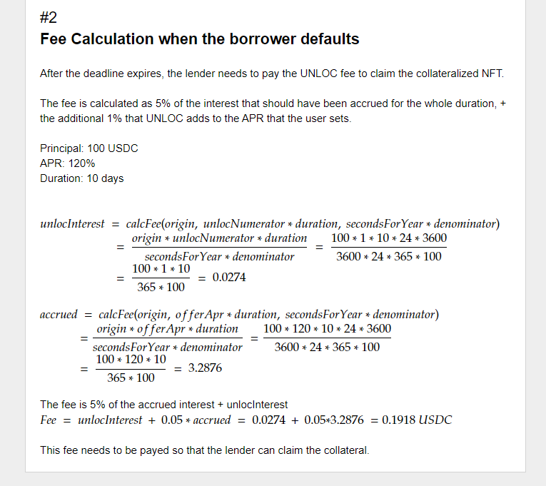
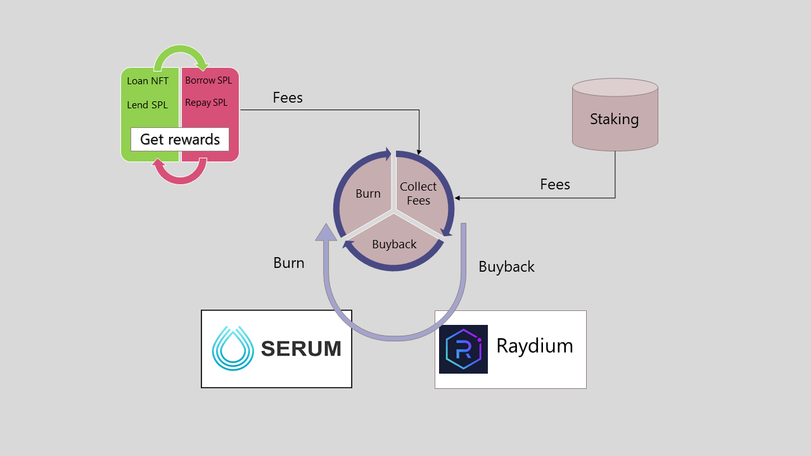

# 
 UNLOC SMART CONTRACT TECHNICAL DOCUMENT 

Unloc is all about unleashing the full potential of NFTs. We want to become a one-stop shop where users can put their NFTs to work while retaining ownership. We plan on continuously exploring new ways to earn or gain liquidity thanks to owning NFTs.

At the moment, our product allows you to gain temporary liquidity by using your NFT as collateral to borrow against. NFT owners create p2p offers that can be accepted by anyone who wants to earn interest on their assets (SOL or USDC). Repaying the borrowed amount with agreed interest in time unlocks the NFT for the original owner. In case of a repayment failure, the other party gains the right to the NFT.

This contains staking, voting, loan, buyback-burn and liquidity mining contract workflows.

## More information

Visit [unloc.xyz](https://www.unloc.xyz) to find out more and join the discussion.

## Unloc System Summary

- [Product Architecture](#product-architecture)
    - [General workflow](#general-workflow)
    - [Project Structure](#project-structure)
    - [How to install & run unit tests](#how-to-install--run)
- [Staking Contract](#staking-contract)
    - [Functional Requirements](#functional-requirements-of-staking)
    - [Use cases](#use-cases-of-staking)
    - [Detailed Information](#detailed-information-of-staking)
- [Voting Contract](#voting-contract)
    - [Functional Requirements](#functional-requirements-of-voting)
    - [Use cases](#use-cases-of-voting)
- [NFT Loan Contract](#nft-loan-contract)
    - [Functional Requirements](#functional-requirements-of-loan)
    - [Use cases](#use-cases-of-loan)
    - [Detailed Information](#detailed-information-of-loan)
- [Buyback & burn Contract](#buyback-burn-contract)
     - [Functional Requirements](#functional-requirements-of-burn)
    - [Use cases](#use-cases-of-burn)
- [Issues & Improvements](#issues--improvements)

## Product Architecture

Unloc project has 3 main packages.

smart contract : https://github.com/UNLOC-DEV/unloc-contracts

integration package: https://github.com/UNLOC-DEV/client

frontend: https://github.com/UNLOC-DEV/unloc

### General Workflow

1. Lender/Borrower stakes UNLOC tokens and get staking rewards & UNLOC score.
2. Lender/Borrower votes to his prefer NFT collection with his voting power what depends on his UNLOC score.
3. By voting score, next rewards amount for each NFT collection is determined.
4. Lender/Borrower loans/borrows NFTs and SOL/USDC. then get UNLOC rewards.
5. All buyback tokens are added to the burn pile and get burned at set intervals.

### Project Structure

- programs

This contains main smart contract codes.

- local-deploy

This contains .so files to siumlate mainnet contract programs.

Addresses are defined in the [[test.genesis]] of Anchor.toml file.

- client

This is sub git module and it should be cloned from integration package repository.

All integration codes and test files are in this repository.

- client/scripts

This directory contains scripts to create & change global program settings.

You can set or change any configurations of contract by running this scripts.

All configurations are defined in the CONFIG.ts file.

You can use next commands to create global settings & pool for your token after you define configurations for staking.

--devnet

yarn run staking:createState:dev

yarn run staking:createRewardConfig:dev

yarn run staking:createPool:dev

yarn run staking:fundReward:dev

--mainnet

yarn run staking:createState:main

yarn run staking:createRewardConfig:main

yarn run staking:createPool:main

yarn run staking:fundReward:main

### How to install & run

git clone https://github.com/UNLOC-DEV/client

npm i -g @project-serum/anchor-cli@0.24.2

yarn install

cd client & yarn install

cd ..

anchor build

anchor run idl

anchor test

anchor deploy

## Staking Contract

User can stake $UNLOC tokens on our platform. User can stake any amount of tokens and can select either flexi (non locked) staking or several locked staking durations. APR starts low on flexi plan and gets higher with duration. APR depends on the remaining lock time of the staking account. The drop isn’t linear, but has cliffs on 5 levels. (e.g. X APR if duration >365 days. Y APR if duration > 180 days...). 

### Functional Requirements of Staking

- Roles

Staking Admin : All control regarding the staking contract belongs to a staking admin.

A staking admin can create pool & reward level configrations, change staking rate, set reward configurations and fund reward.

User: can stake tokens according to a provided level plan.

- Features

Create pool

Create extra rewards configurations. Max levels can be 10.

Change reward rate & reward configurations

Fund reward tokens

Stake tokens and harvest the rewards

- Early unlock fee

Any locked tokens can be unlocked before the expiry date by paying a 50% penalty fee. User can do that separately for any “staking” account he has active. If a user decides to unlock their tokens early, they receive 50% of previously locked tokens converted to a flexible (unlocked) staking account and they are available for a withdrawal. Tokens gathered by penalty fees will be burnt at some regular intervals (e.g. monthly)

### Use cases of Staking

1. Admin sets staking levels with specific staking period and extra reward (APY).
2. Admin funds UNLOC rewards token to staking contract.
3. User stakes UNLOC tokens and get rewards.
4. User's UNLOC score is determined by staking period and amount.
5. User can unstake his locked tokens by paying penalty fee (early unlock fee).

### Detailed Information of Staking

This section contains detailed information about staking contract & scripts.

- create_state.ts (interacting with create_state() function in the contract)

set STAKING_RATE in the CONFIG.ts file to run this command.

command: yarn run staking:createState:main

this creates global state and set super owner of this program.

- create_reward_config.ts (interacting with create_reward_config() function in the contract)

set REWARD_CONFIGS in the CONFIG.ts file to run this command.

REWARD_CONFIGS can be array with max 10 items.

duration means lock duration for the level.

extraPercentage means extra reward than general reward.

command: yarn run staking:createRewardConfig:main

this creates extra reward configuration account.

- create_pool.ts (interacting with create_pool() function in the contract)

set REWARD_TOKEN_ID, POOL_POINT & POOL_AMOUNT_MULTIPLIER in the CONFIG.ts file to run this command.

REWARD_TOKEN_ID should be the reward token mint address.

POOL_POINT means reward percentage of total for this pool.

POOL_AMOUNT_MULTIPLIER is amplifier of POOL_POINT.

command: yarn run staking:createPool:main

This creates one pool with given reward point.

- fund_reward.ts (interacting with fund_reward() function in the contract)

set FUND_AMOUNT in the CONFIG.ts file to run this command.

command: yarn run staking:fundReward:main

This funds reward token with given amount.

- change_staking_rate.ts (interacting with change_staking_rate() function in the contract)

set STAKING_RATE in the CONFIG.ts file to run this command.

command: yarn run staking:changeStakingRate:main

This changes staking reward rate in the global settings.

- set_reward_config.ts (interacting with set_reward_config() function in the contract)

set REWARD_CONFIGS in the CONFIG.ts file to run this command.

command: yarn run staking:setRewardConfig:main

This updates current extra reward configurations with given one.

- change_pool_point.ts (interacting with change_pool_point() function in the contract)

set POOL_POINT in the CONFIG.ts file to run this command.

command: yarn run staking:changePoolPoint:main

This updates current pool point with given one.

If you are using single pool for staking, the pool point is full point of rewards.

- change_pool_multipler.ts (interacting with change_pool_multipler() function in the contract)

set POOL_AMOUNT_MULTIPLIER in the CONFIG.ts file to run this command.

command: yarn run staking:changePoolMultipler:main

This updates current pool multipler with given one.

Except above functions, there are stake, unstake & harvest for users.

## Voting Contract

Voting power will be entirely based on UNLOC score. Higher UNLOC score means “more votes”.
Users will have an opportunity, by voting, to decide what percentage of the emissions go to which collection for a liquidity mining program. Votes will be held during a period of time, probably week, and will determine the emission allocation for the next period of the same length. User has the right to vote just once during that period, at the time of his choice, and his voting is disabled until the next reset.

### Functional Requirements of Voting

- Roles

Voting organizer: can create new voting and reset current voting.

Voting organizer determines what NFT collections will be used for next rewards and set voting items with the NFT collections.

Voting users: can vote for special NFT collection for the next rewards percent.

Voting users should stake some UNLOC tokens to get voting power.

### Use cases of Voting

1. Admin sets voting items with NFT collections for next rewards.
2. Users who has UNLOC score votes for specific NFT collection.
3. Next UNLOC rewards amount is distributed by voted score.

## NFT Loan Contract

Unloc NFT Loaing is a peer-to-peer (P2P) and pool based decentralised protocol where NFT owners can take out a loan using their NFT token(s) as collateral. Initially, we aim to build momentum on the Solana blockchain due to it’s speed, growth, and it’s well-defined Metaplex NFT platform.

### Functional Requirements of Loan

- Fees

The platform adds fixed APR percentage and takes a rate from the interest

*Example: 1000 USDC, 30 days, 12% APR*

*Fee: UNLOC adds 1% to the agreed APR and takes 5% of the interest earned by the lender*

Scenario 1: Borrower repays

The borrower makes the offer. The lender accepts the terms set by Borrower (as in the example). UNLOC adds a 1% fixed APR to any deal (in this example APR for Borrower is 13%).  After 10 days Borrower decides to repay his loan. As per the example above, he pays back the original 1000 USDC loan + 3.56$ interest for 10 days. Lender gets back the original 1000 USDC loan + 3.12 interest (3.29 interest - 5% UNLOC fee). UNLOC receives 0.27$ (added 1% APY) + 0.16$ (5% of the Lenders interest). 

Scenario 2: Borrower defaults

The borrower makes the offer. The lender accepts the terms set by Borrower (as in the example). After the set deadline expires, if the loan is not repaid, the Borrower defaults. In that case, the Lender can claim collateralized NFT after he pays the UNLOC fee. As per the example above, the Lender needs to pay 1.31$ (5% from generated 30-day interest as per example + 1% that UNLOC adds to APR), and then he can claim collateralized NFT. Suppose Lister does not claim the NFT (deadline being the duration of the original contract with a minimum of 30 days and a maximum of 90 days). In that case, UNLOC will liquidate NFT and take the UNLOC fee and 25% of the remaining funds as the penalty fee. 75% of the remaining value is transferred directly to the lender account.

### Use cases of Loan

1. Admin sets reward rate from voting system and deposit UNLOC tokens for rewards distribution.
2. Borrower create loan offers.
3. Lender accpets offer and lend SOL/SPL token to borrower.
4. Borrower repays borrowed SOL/SPL and get his NFT again.
5. Lender/Borrower gets UNLOC rewards for loaning duration.
6. All UNLOC tokens from fees goes to buyback-burn program.

### Detailed Information of Loan

- Global State

        unlocNumerator = 1 

Spec defines that Unloc adds an additional 1% on top of the APR user specified

        denominator = 100 

The denominator (I THINK) is used to normalize the APR percentages to actual decimal values, e.g. 120% to 1.2 and 1% to 0.01, meaning we need to divide it by 100.

If we are using basis points however, then the denominator needs to be higher (10000)

        secondsForYear = 3600 * 24 * 365

- Loan Offer

        origin = 100 // Principal

        offerApr = 120 // Set as 120% in the UI

        duration = 10 * 24 * 3600 (10 days, Unix TS)

- Utility function

        calcFee(total, feePercent, denominator) {
            return total * feePercent / denominator
        }

## Buyback burn Contract

Set percentage of the gathered platform fees will be automatically used to buyback UNLOC tokens on the Serum pair.
All buyback tokens are added to the burn pile and get burned at set intervals.

Tokens collected from early unlock fees and buyback program AND FEATURED PAYMENTS are burned at some intervals (e.g. monthly) and a big PR stunt is created every time that happens.

We use raydium pool to buyback and burn UNLOC tokens.
And for the interval actions, we call it from the backend regularly.

### Functional Requirements of Burn

- UNLOC tokens are collected from Loan and Staking program.
- SOL/USDC tokens are collected from Loan and Staking program too.
- Contract buybacks SOL/USDC tokens to UNLOC via Raydium & Serum regularly.
- Contract burns collected UNLOC tokens at certain intervals.
### Use cases of Burn

1. All fees go to buyback-burn program
2. buyback-burn program uses raydium & serum to buyback SOL/USDC to UNLOC.
3. All buybacked & collected UNLOC tokens are burnt at certain intervals.

## Issues & Improvements

1. usage of NFT collection in the contract (loan & voting)

mpl-token-metadata program supports nft collection as public key but past versions doesn't support it and there will be so many nft collections without collection key as public key.

2. auto-liquidation process for expired NFTs in the loan contract

We liquidate expired NFTs manually at the moment.
But we need automation of liquidation process.

3. weak security codes

We need to write security codes and audit all smart contract codes so that it can be safe.